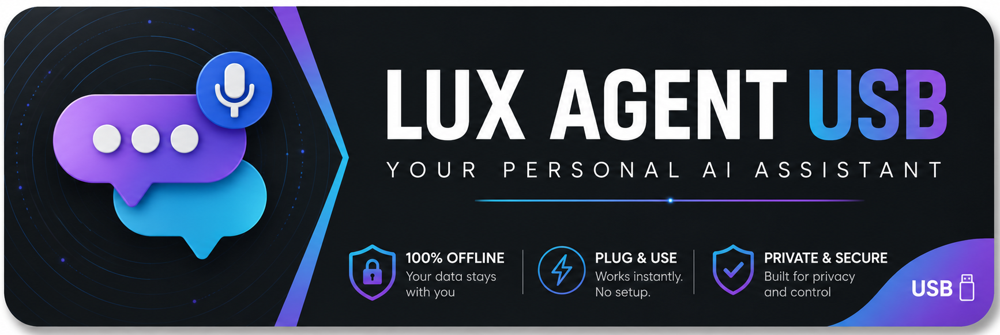
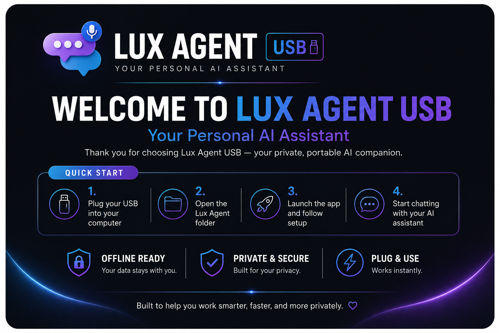

<p align="center">
  
</p>

# 🚀 Lux Agent — Your Personal AI Business OS

> **Automate. Innovate. Accelerate.**
> The first offline AI operating system that runs from a USB drive. No cloud. No subscriptions. Your data stays yours.

[](https://luxautomaton-ux.github.io/lux-agent-website)
[](https://nextjs.org)
[]()
[]()

---

## 🧠 What is Lux Agent?

Lux Agent is a **plug-and-play AI business operating system** on a USB drive. Plug it into any Mac, Windows, or Linux machine and get:

- 🤖 **LANA** — Your personal AI assistant that works offline
- 📊 **Business Dashboard** — Real-time metrics, reports, and insights
- 💰 **Money Suite** — Budgeting, write-offs, tax tools, and financial reports
- 🎯 **Success Packs** — Industry-specific AI tools for your business
- 🔒 **100% Offline** — No cloud, no subscriptions, no data leaving your machine

---

## ⚡ Features

| Feature | Description |
|---------|-------------|
| **LANA AI Assistant** | Voice + text AI that knows your business |
| **Offline AI Models** | 3 built-in models (qwen2.5, gemma2, llama3.2) |
| **Business Briefings** | Daily automated reports and summaries |
| **Money Suite** | Budgeting, write-off tracker, financial reports |
| **Success Packs** | Contractor, Clinic, Studio, Creator, and more |
| **License Gate** | Built-in activation system for selling USB drives |
| **USB Creator App** | Clone and brand USBs for your customers |

---

## 🏗️ Tech Stack

- **Framework:** Next.js 16 (React 19)
- **AI Runtime:** Ollama (local inference)
- **Desktop App:** Electron
- **Styling:** Custom CSS with glassmorphism design
- **Deployment:** GitHub Pages (static export)

---

## 🚀 Getting Started

```bash
# Clone the repo
git clone https://github.com/luxautomaton-ux/lux-agent-website.git
cd lux-agent-website

# Install dependencies
npm install

# Run locally
npm run dev

# Build for production
npm run build
```

---

## 🌐 Live Website

**[https://luxautomaton-ux.github.io/lux-agent-website](https://luxautomaton-ux.github.io/lux-agent-website)**

---

## 📦 Product Tiers

| Tier | What You Get | Price |
|------|-------------|-------|
| **Starter** | LANA + Dashboard + Cloud AI | $149 |
| **Offline** | Everything + 3 Local AI Models | $349 |
| **Pro Offline** | Everything + Premium Models + Priority Support | $549 |

---

## 🛡️ Security & Privacy

- All data stays on the USB drive
- No telemetry, no tracking, no cloud sync
- API keys never leave your machine
- Clean clone system strips credentials for customer drives

---

## 📄 License

Proprietary — © 2026 Lux Automaton. All rights reserved.

---

<p align="center">
  
</p>
